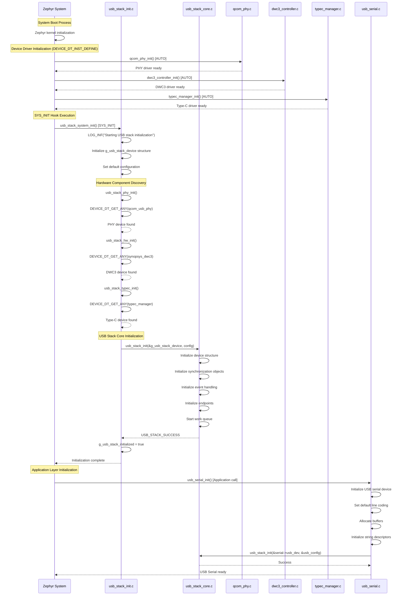
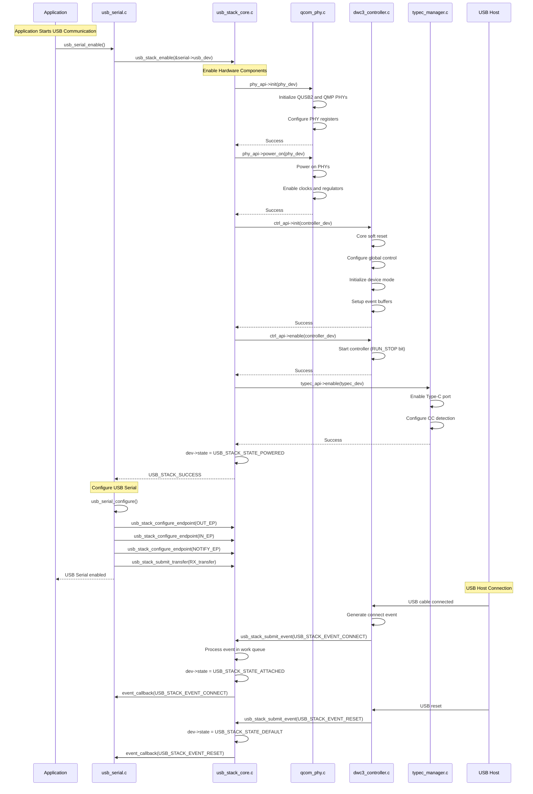
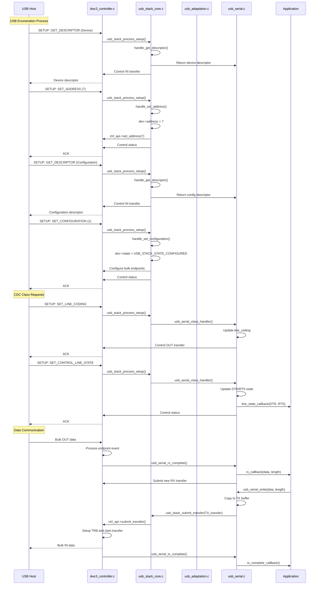
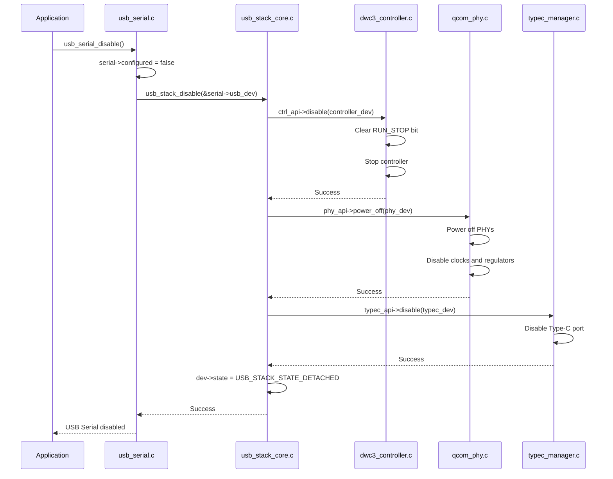

# USB Stack Sequence Diagrams and Initialization Analysis

This document contains comprehensive sequence diagrams and analysis for the USB stack implementation based on the current code structure.

## 1. USB Stack Initialization Sequence



## 2. USB Stack Enable/Runtime Sequence



## 3. USB Serial Communication Sequence



## 4. USB Stack Deinitialization Sequence



## How USB Stack Gets Enabled

### **1. Automatic System Initialization (SYS_INIT)**

The USB stack is automatically enabled during Zephyr system boot through the `SYS_INIT` mechanism:

```c
// In usb_stack_init.c
SYS_INIT(usb_stack_system_init, POST_KERNEL, CONFIG_USB_STACK_INIT_PRIORITY);
```

**Boot Sequence:**
1. **Zephyr Kernel Boot** → **Device Driver Init** → **SYS_INIT Hooks** → **Application Init**

2. **Device Driver Initialization (Automatic):**
   - `qcom_phy_init()` - Called by `DEVICE_DT_INST_DEFINE` macro
   - `dwc3_controller_init()` - Called by `DEVICE_DT_INST_DEFINE` macro  
   - `typec_manager_init()` - Called by `DEVICE_DT_INST_DEFINE` macro

3. **USB Stack System Init (SYS_INIT):**
   - `usb_stack_system_init()` called at priority `CONFIG_USB_STACK_INIT_PRIORITY`
   - Discovers hardware devices using `DEVICE_DT_GET_ANY()`
   - Initializes USB stack core with `usb_stack_init()`
   - Sets `g_usb_stack_initialized = true`

### **2. Application-Level Enablement**

Applications enable USB functionality by calling:

```c
// Application code
usb_serial_init();      // Initialize USB serial
usb_serial_enable();    // Enable USB serial communication
```

**Application Flow:**
1. **`usb_serial_init()`** → Initialize USB serial device structure
2. **`usb_serial_enable()`** → Call `usb_stack_enable()` → Enable hardware components
3. **Hardware Enablement** → PHY power on → Controller enable → Type-C enable
4. **USB Ready** → Device appears on USB bus for host enumeration

### **3. Configuration Control**

The USB stack enablement is controlled by:

**Kconfig Options:**
- `CONFIG_USB_STACK_QCOM_PHY` - Enable Qualcomm PHY support
- `CONFIG_USB_STACK_DWC3_CONTROLLER` - Enable DWC3 controller support  
- `CONFIG_USB_STACK_TYPEC_SUPPORT` - Enable Type-C support
- `CONFIG_USB_STACK_INIT_PRIORITY` - Set initialization priority

**Device Tree:**
- Hardware devices must be defined in device tree
- `DEVICE_DT_GET_ANY()` discovers devices from device tree
- Missing device tree entries result in initialization failure

### **4. Runtime Control**

**Enable USB Stack:**
```c
struct usb_stack_device *dev = usb_stack_get_device();
usb_stack_enable(dev);  // Powers on PHY, enables controller
```

**Disable USB Stack:**
```c
usb_stack_disable(dev); // Powers off PHY, disables controller
```

### **5. Key Initialization Points**

1. **System Boot** → `SYS_INIT(usb_stack_system_init)` → USB stack structure ready
2. **Application Start** → `usb_serial_enable()` → Hardware powered and enabled
3. **USB Connection** → Host detects device → Enumeration begins
4. **Configuration** → Host sets configuration → Endpoints active → Data transfer ready

The USB stack uses a **two-phase initialization**:
- **Phase 1 (System)**: Structure initialization and device discovery
- **Phase 2 (Application)**: Hardware enablement and USB bus connection

This design allows the USB stack to be ready for use while giving applications control over when USB functionality is actually enabled on the bus.

## USB Stack Architecture Overview

```
┌─────────────────────────────────────────────────────────────┐
│                    Application Layer                        │
│              (usb_serial.c - CDC ACM)                       │
├─────────────────────────────────────────────────────────────┤
│                   Adaptation Layer                          │
│            (usb_adaptation.c - Standard Requests)           │
├─────────────────────────────────────────────────────────────┤
│                 Function Driver Layer                       │
│              (usb_function_driver.c)                        │
├─────────────────────────────────────────────────────────────┤
│                 Device Core Layer                           │
│            (usb_device_core.c - State Machine)              │
├─────────────────────────────────────────────────────────────┤
│                USB Stack Core                               │
│         (usb_stack_core.c - Event Processing)               │
├─────────────────────────────────────────────────────────────┤
│                Controller Layer                             │
│              (dwc3_controller.c)                            │
├─────────────────────────────────────────────────────────────┤
│                  Hardware Layer                             │
│    (qcom_phy.c + typec_manager.c + Hardware Registers)      │
└─────────────────────────────────────────────────────────────┘
```

## Key Files and Their Roles

| File | Role | Key Functions |
|------|------|---------------|
| `usb_stack_init.c` | System initialization and device discovery | `usb_stack_system_init()`, `SYS_INIT` |
| `usb_stack_core.c` | Core USB stack functionality and event processing | `usb_stack_init()`, `usb_stack_enable()` |
| `usb_serial.c` | USB CDC ACM serial communication | `usb_serial_init()`, `usb_serial_enable()` |
| `dwc3_controller.c` | DWC3 hardware controller driver | `dwc3_controller_init()`, interrupt handling |
| `qcom_phy.c` | Qualcomm USB PHY driver | `qcom_phy_init()`, power management |
| `typec_manager.c` | Type-C port management | `typec_manager_init()`, CC detection |
| `usb_adaptation.c` | USB standard request handling | Standard setup packet processing |

## Event Flow Summary

1. **System Boot** → Hardware drivers auto-initialize → USB stack structure ready
2. **Application Call** → `usb_serial_enable()` → Hardware powered on → USB bus active
3. **Host Connection** → Cable connected → Events generated → State transitions
4. **Enumeration** → Setup packets → Descriptors exchanged → Device configured
5. **Data Transfer** → Bulk transfers → Application callbacks → Serial communication active
6. **Disconnection** → Cable removed → Events generated → Hardware powered down

This comprehensive flow ensures proper USB device operation from system boot through active communication and clean shutdown.
